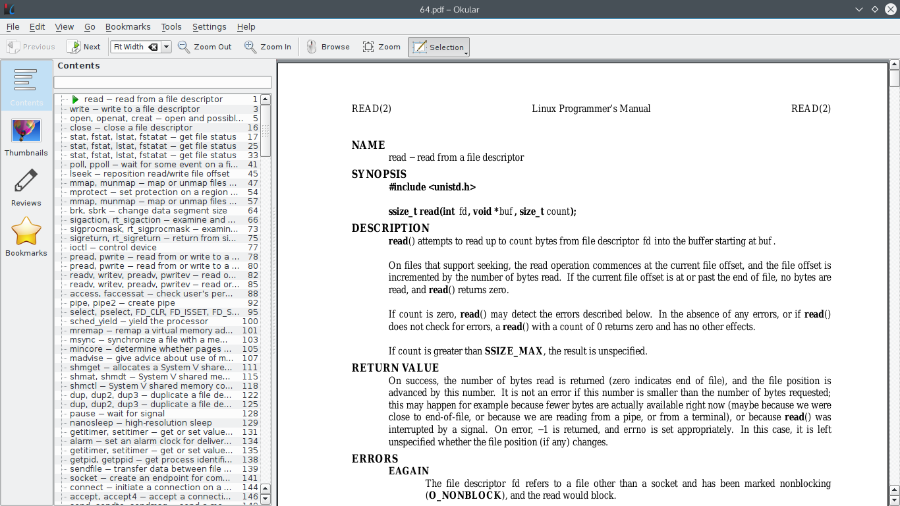

# man2pdf
# Man 格式转 PDF



## Usage
## 用法

```
./man2pdf.sh path-to-man-pages-directory
```

where the `path-to-man-pages-directory`
is the root directory of the decompressed man-pages release,
which is available at
[The Linux man-pages project](https://www.kernel.org/doc/man-pages/).

```
./man2pdf.sh 手册压缩包解压后的主文件夹
```

Man 手册的 tar 包可以在这儿下载
[The Linux man-pages project](https://www.kernel.org/doc/man-pages/)
。

## Output
## 输出

Eight manuals in PDF format, and one 32.pdf and a 64.pdf.

Note _pdf is merely a temporay directory.

输出为带有书签的 man1 到 man8，再加上一份大致按照 32 位系统调用中断号排列的 man2，
和一份大致按 64 位的。

## Dependencies
## 依赖

- pdfroff, which comes from the package groff

- pdfroff，由软件包 groff 提供

- [pdfbookmark](https://github.com/NoviceLive/pdfbookmark), I wrote

- [pdfbookmark](https://github.com/NoviceLive/pdfbookmark)，我写的

## NOTE
## 提醒

You had better clone it with `--depth 1` option.

请使用 `--depth 1` 参数克隆。

## TODO
## 改进

+ Improve the regex because the current is unbearably ugly

+ 正则表达式写起太丑

## License
## 授权

For man pages, see their own description.

For this script, GPL.

Man 手册的授权请看它发行所带的授权文件。

该转换脚本 GPL。
